<p align="center">
  
<p align="center">
  
</p>

You can add a stylish animated banner to the top of your README using **[Capsule Render](https://capsule-render.vercel.app/)** — no design tool needed.

**Steps:**

1. Open this link in your browser:  
   `https://capsule-render.vercel.app/api?type=waving&height=300&text=Project%20Title`

2. Replace `Project%20Title` in the URL with your own project name (use `%20` for spaces).  
   Example: `text=TailorPro`

3. Once you like the preview, copy the full URL.

4. Paste it into your `README.md` using this HTML snippet, replacing the `src` value with your copied link:

```html
   <p align="center">
     
   </p>
```

Save, commit, and push — your animated header banner will now show up live on GitHub.

**Demo:**

<p align="center">
  
 <p align="center"> ALL your content of Readme between these Ok.</p>
</p>
<p align="center">
  
</p>
**Workflow:**

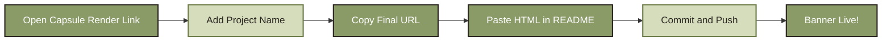

<br><br>

<p align="center">
  
</p>

You can showcase your project's technologies using **[Shields.io](https://shields.io/)** — clean, colorful badges for every tool in your stack.

**Steps:**

1. List out every major tool, language, and framework used in your project (e.g. React, Node.js, MongoDB).

2. Generate a badge URL for each technology using this format:  
   `https://img.shields.io/badge/{TEXT}-{HEX_COLOR}?style=for-the-badge&logo={LOGO_NAME}&logoColor={LOGO_COLOR}`  
   Example: `text=React`, `logo=react`

3. Find official logo names at **[Simple Icons](https://simpleicons.org/)** — search your tech and copy its slug.

4. Paste each badge into your `README.md` using this HTML snippet, adding one `` line per technology:

```html
   <p align="center">
     
   </p>
```

Save, commit, and push — your badges will now show up live on GitHub.

**Demo:**

<p align="center">
  
  
  
  
  
  
  
  
  
  
  
  
  
  
  
</p>

**Workflow:**

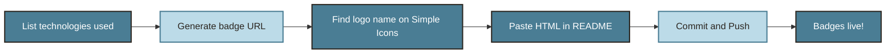

<br><br>

<p align="center">
  
</p>

You can add a visual, horizontal workflow diagram using **[Mermaid](https://mermaid.js.org/)** — GitHub renders it automatically, no image or external tool needed.

**Steps:**

1. Open your `README.md` file and decide where the workflow should appear.

2. Add a code block starting with ` ```mermaid ` and define your flow using `flowchart LR` (left-to-right).

3. List each step as a labeled box, connecting them with arrows (`-->`).

4. Save, commit, and push — GitHub will render it as a live diagram.

**Demo:**

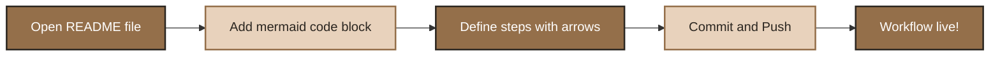

<br><br>

<p align="center">
  
</p>

You can visualize your project's structure using **[Mermaid](https://mermaid.js.org/)** — showing how different parts (frontend, backend, database) connect, directly inside your README.

**Steps:**

1. Identify the main components of your project (e.g. Client, Server, Database, APIs).

2. Open your `README.md` and add a code block starting with ` ```mermaid `.

3. Use `flowchart TD` (top-down) to show layers, connecting each component with arrows to show data/request flow.

4. Save, commit, and push — GitHub will render it as a live architecture diagram.

**Demo:**

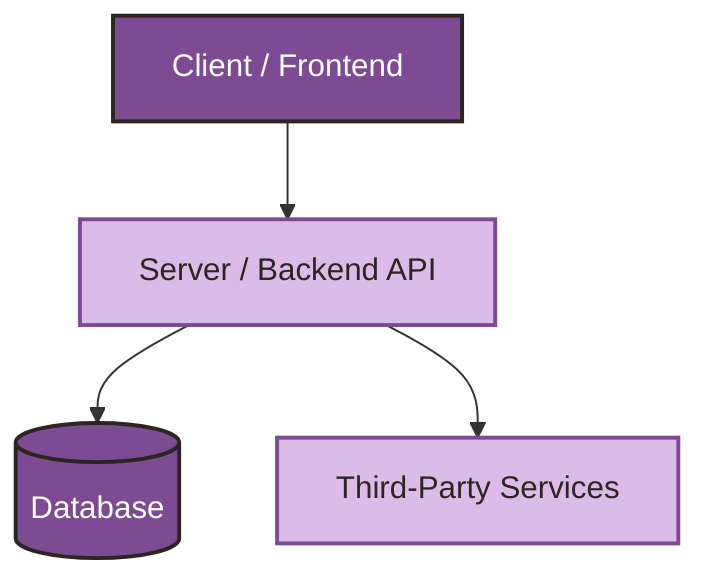

<br><br>

<p align="center">
  
</p>

A clean, well-organized folder structure makes your project easy to navigate for anyone who opens the repo — including future you.

**Steps:**

1. Decide your top-level folders (e.g. `client`, `server`, `docs`, `config`).

2. Inside your `README.md`, add a fenced code block using triple backticks and no language tag, so indentation stays intact.

3. Use tree-style symbols (`├──`, `└──`, `│`) to represent nesting — you can type these manually or copy them from an existing tree.

4. Save, commit, and push — GitHub will display it as a clean, monospaced folder tree.

**Demo:**

```
project-root/
├── client/
│   ├── src/
│   │   ├── components/
│   │   ├── pages/
│   │   └── App.js
│   └── package.json
├── server/
│   ├── controllers/
│   ├── models/
│   ├── routes/
│   └── server.js
├── config/
│   └── db.js
├── .env
├── .gitignore
└── README.md
```

**Workflow:**

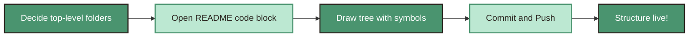

<br><br>


<p align="center">
  
</p>

If your project has a design system, listing your color palette helps contributors stay visually consistent.

**Steps:**

1. Identify your main color palette (primary, secondary, background, text colors).

2. Create a Markdown table with color name, hex code, and a visual swatch.

3. Use a small colored square image or emoji block for the swatch column.

4. Save, commit, and push.

**Demo:**

| Color | Hex |
|-------|-----|
|  Primary | `#BCCCAF` |
|  Secondary | `#8CA084` |
|  Text | `#2B2620` |

**Workflow:**

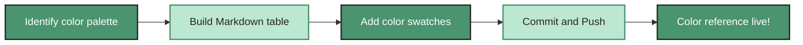

<br><br>
<p align="center">
  
</p>

Document your API endpoints clearly so other developers know how to interact with your backend.

**Steps:**

1. List each endpoint with its HTTP method (GET, POST, PUT, DELETE).

2. For each endpoint, specify the request format (params, body) and response format.

3. Use a Markdown table or code blocks to keep it organized and scannable.

4. Save, commit, and push — your API docs will render cleanly on GitHub.

**Demo:**

```
GET /api/users
```
Returns a list of all users.

**Response:**

```json
{
  "id": "123",
  "name": "John Doe",
  "email": "john@example.com"
}
```

**Workflow:**

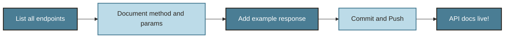

<br><br>

<p align="center">
  
</p>

Give clear, copy-paste-ready steps so anyone can clone and run your project on their own machine.

**Steps:**

1. Add the clone command with your repo URL.

2. List commands to install dependencies for both client and server (if applicable).

3. Include the command to start the development server.

4. Save, commit, and push.

**Demo:**

```bash
# Clone the repository
git clone https://github.com/yourusername/your-repo.git

# Go to the project directory
cd your-repo

# Install dependencies
npm install

# Start the server
npm run dev
```

**Workflow:**

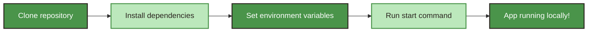

<br><br>

<p align="center">
  
</p>

Use the appendix for extra reference material that doesn't fit neatly into the main sections — glossaries, extended notes, or related links.

**Steps:**

1. Identify any extra details, definitions, or references your README doesn't cover elsewhere.

2. Add a heading titled "Appendix" near the bottom of your README.

3. List supplementary content using bullet points or sub-headings.

4. Save, commit, and push.

**Demo:**

- **Glossary:** JWT — JSON Web Token, used for authentication
- **Related Docs:** [Link to external documentation]
- **Additional Notes:** Any edge cases or known limitations

**Workflow:**

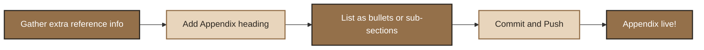

<br><br>

<p align="center">
  
</p>

Let others know how they can contribute to your project — pull requests, issues, and coding standards.

**Steps:**

1. Explain how to fork and clone the repository.

2. List the branch naming convention and commit message style you expect.

3. Explain how to open a pull request and what checks it must pass.

4. Save, commit, and push.

**Demo:**

1. Fork the repository
2. Create your feature branch: `git checkout -b feature/AmazingFeature`
3. Commit your changes: `git commit -m 'Add some AmazingFeature'`
4. Push to the branch: `git push origin feature/AmazingFeature`
5. Open a Pull Request

**Workflow:**

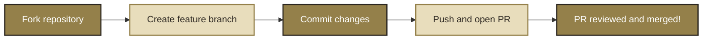

<br><br>

<p align="center">
  
</p>

Show your project in action with a screenshot, GIF, or live link — this is often the first thing people look at.

**Steps:**

1. Take a screenshot or screen recording of your app (use tools like ScreenToGif or Kap for GIFs).

2. Upload the image/GIF to your repo (e.g. an `assets` folder) or host it externally.

3. Embed it using Markdown image syntax.

4. Save, commit, and push.

**Demo:**

```markdown

```

Or link to a live deployed version:

```markdown
🔗 [Live Demo](https://your-deployed-app.com)
```

**Workflow:**

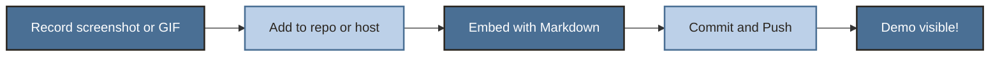

<br><br>

<p align="center">
  
</p>

Explain how to deploy your project so others can get it running in production.

**Steps:**

1. List the platforms used (e.g. Vercel for frontend, Render for backend, MongoDB Atlas for database).

2. Add the exact commands or steps needed to deploy each part.

3. Mention any required environment variables for deployment.

4. Save, commit, and push.

**Demo:**

```bash
# Build the frontend
npm run build

# Deploy to Vercel
vercel --prod
```

**Workflow:**

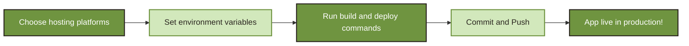

<br><br>

<p align="center">
  
</p>

Link out to detailed documentation for setup, usage, or advanced configuration if your README alone isn't enough.

**Steps:**

1. Decide if documentation lives in a `/docs` folder, a wiki, or an external site.

2. Add a short description of what the docs cover.

3. Link directly to the documentation.

4. Save, commit, and push.

**Demo:**

📚 Full documentation is available [here](./docs/README.md).

**Workflow:**

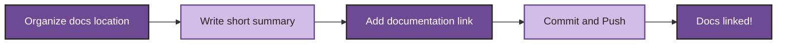

<br><br>

<p align="center">
  
</p>

Answer common questions users or contributors might have about your project.

**Steps:**

1. Collect the questions you're most often asked about the project.

2. Format each as a bold question followed by a short answer.

3. Keep answers concise — link to detailed docs for longer explanations.

4. Save, commit, and push.

**Demo:**

**Q: How do I reset my database?**  
A: Run `npm run seed` to reset and repopulate sample data.

**Q: Can I use this without MongoDB?**  
A: Currently no, MongoDB is required as the primary database.

**Workflow:**

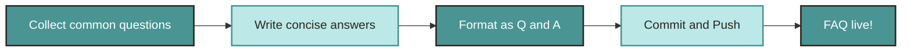

<br><br>

<p align="center">
  
</p>

Share the key challenges you faced and what you learned while building the project — helpful for your own growth and for others in similar situations.

**Steps:**

1. Reflect on the hardest problems you solved during development.

2. Note what approach worked, and what you'd do differently next time.

3. Write each as a short bullet point under a "Lessons Learned" heading.

4. Save, commit, and push.

**Demo:**

- Learned how to structure JWT-based authentication securely across client and server
- Realized early schema planning saves major refactoring time later
- Improved error handling by centralizing it in Express middleware

**Workflow:**

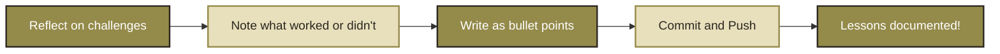

<br><br>

<p align="center">
  
</p>

Visuals help people quickly understand what your app looks like and does, without running it themselves.

**Steps:**

1. Capture clear screenshots of your app's key screens (dashboard, login, main feature).

2. Save them in an `assets` or `screenshots` folder in your repo.

3. Embed each with Markdown image syntax, optionally with a caption.

4. Save, commit, and push.

**Demo:**

```markdown


```

**Workflow:**

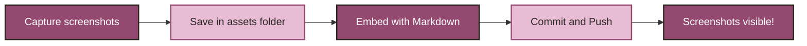

<br><br>

<p align="center">
  
</p>

A short technical overview — the core languages, frameworks, and tools that power the project.

**Steps:**

1. List the primary tech stack in one line (client, server, database).

2. Optionally mention key libraries or tools used for specific features (auth, state management, etc.).

3. Keep it brief — detailed badges belong in a separate "Tech Stack Badges" section.

4. Save, commit, and push.

**Demo:**

**Frontend**
<p align="left">
  
  
</p>

**Backend**
<p align="left">
  
  
</p>

**Database**
<p align="left">
  
</p>

**Workflow:**

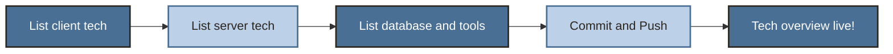

<br><br>
<p align="center">
  
</p>
