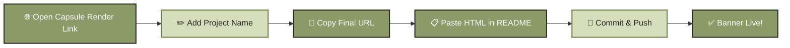
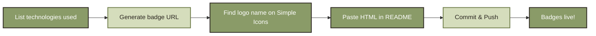

<p align="center">
  
</p>

You can add a stylish animated banner to the top of your README using **[Capsule Render](https://capsule-render.vercel.app/)** — no design tool needed.

**Steps:**

1. Open this link in your browser:  
   `https://capsule-render.vercel.app/api?type=waving&height=300&text=Project%20Title`

2. Replace `Project%20Title` in the URL with your own project name (use `%20` for spaces).  
   Example: `text=TailorPro`

3. Once you like the preview, copy the full URL.

4. Paste it into your `README.md` using this HTML snippet, replacing the `src` value with your copied link:

```html
   <p align="center">
     
   </p>
```

Save, commit, and push — your animated header banner will now show up live on GitHub.
<p align="center">
  
</p>

### 🔄 Workflow


<p align="center">
  

  You can showcase your project's technologies using **[Shields.io](https://shields.io/)** — clean, colorful badges for every tool in your stack.

**Steps:**

1. List out every major tool, language, and framework used in your project (e.g. React, Node.js, MongoDB).

2. Generate a badge URL for each technology using this format:  
   `https://img.shields.io/badge/{TEXT}-{HEX_COLOR}?style=for-the-badge&logo={LOGO_NAME}&logoColor={LOGO_COLOR}`  
   Example: `text=React`, `logo=react`

3. Find official logo names at **[Simple Icons](https://simpleicons.org/)** — search your tech and copy its slug.

4. Paste each badge into your `README.md` using this HTML snippet, adding one `` line per technology:

```html
   <p align="center">
     
   </p>
```
Save, commit, and push — your animated header banner will now show up live on GitHub.
<p align="center">
  
  
  
  
  
  
  
  
  
  
  
  
  
  
  
</p>

**Workflow:**


