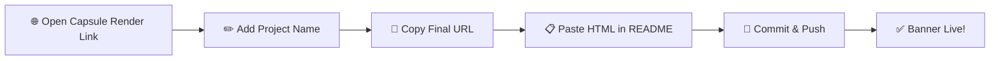

### 🎨 Adding an Animated Header Banner

You can add a stylish animated banner to the top of your README using **[Capsule Render](https://capsule-render.vercel.app/)** — no design tool needed.

**Steps:**

1. Open this link in your browser:  
   `https://capsule-render.vercel.app/api?type=waving&height=300&text=Project%20Title`

2. Replace `Project%20Title` in the URL with your own project name (use `%20` for spaces).  
   Example: `text=TailorPro`

3. Once you like the preview, copy the full URL.

4. Paste it into your `README.md` using this HTML snippet, replacing the `src` value with your copied link:

```html
   <p align="center">
     
   </p>
```

Save, commit, and push — your animated header banner will now show up live on GitHub.
<p align="center">
  
</p>

### 🔄 Workflow


