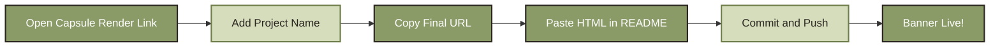
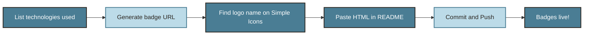
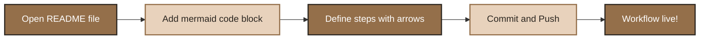
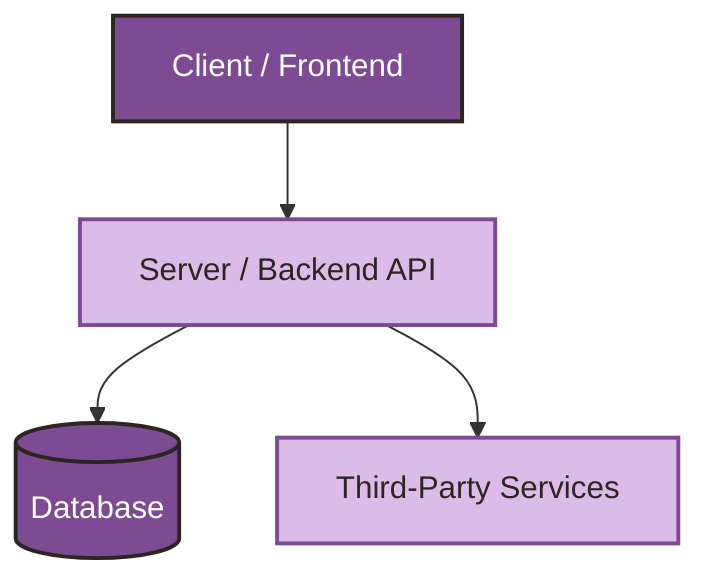
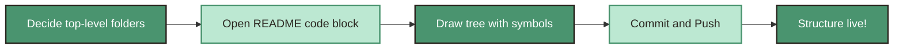

<p align="center">
  
</p>

You can add a stylish animated banner to the top of your README using **[Capsule Render](https://capsule-render.vercel.app/)** — no design tool needed.

**Steps:**

1. Open this link in your browser:  
   `https://capsule-render.vercel.app/api?type=waving&height=300&text=Project%20Title`

2. Replace `Project%20Title` in the URL with your own project name (use `%20` for spaces).  
   Example: `text=TailorPro`

3. Once you like the preview, copy the full URL.

4. Paste it into your `README.md` using this HTML snippet, replacing the `src` value with your copied link:

```html
   <p align="center">
     
   </p>
```

Save, commit, and push — your animated header banner will now show up live on GitHub.

**Demo:**

<p align="center">
  
</p>

**Workflow:**



<br><br>

<p align="center">
  
</p>

You can showcase your project's technologies using **[Shields.io](https://shields.io/)** — clean, colorful badges for every tool in your stack.

**Steps:**

1. List out every major tool, language, and framework used in your project (e.g. React, Node.js, MongoDB).

2. Generate a badge URL for each technology using this format:  
   `https://img.shields.io/badge/{TEXT}-{HEX_COLOR}?style=for-the-badge&logo={LOGO_NAME}&logoColor={LOGO_COLOR}`  
   Example: `text=React`, `logo=react`

3. Find official logo names at **[Simple Icons](https://simpleicons.org/)** — search your tech and copy its slug.

4. Paste each badge into your `README.md` using this HTML snippet, adding one `` line per technology:

```html
   <p align="center">
     
   </p>
```

Save, commit, and push — your badges will now show up live on GitHub.

**Demo:**

<p align="center">
  
  
  
  
  
  
  
  
  
  
  
  
  
  
  
</p>

**Workflow:**



<br><br>

<p align="center">
  
</p>

You can add a visual, horizontal workflow diagram using **[Mermaid](https://mermaid.js.org/)** — GitHub renders it automatically, no image or external tool needed.

**Steps:**

1. Open your `README.md` file and decide where the workflow should appear.

2. Add a code block starting with ` ```mermaid ` and define your flow using `flowchart LR` (left-to-right).

3. List each step as a labeled box, connecting them with arrows (`-->`).

4. Save, commit, and push — GitHub will render it as a live diagram.

**Demo:**



<br><br>

<p align="center">
  
</p>

You can visualize your project's structure using **[Mermaid](https://mermaid.js.org/)** — showing how different parts (frontend, backend, database) connect, directly inside your README.

**Steps:**

1. Identify the main components of your project (e.g. Client, Server, Database, APIs).

2. Open your `README.md` and add a code block starting with ` ```mermaid `.

3. Use `flowchart TD` (top-down) to show layers, connecting each component with arrows to show data/request flow.

4. Save, commit, and push — GitHub will render it as a live architecture diagram.

**Demo:**



<br><br>
<p align="center">
  
</p>

A clean, well-organized folder structure makes your project easy to navigate for anyone who opens the repo — including future you.

**Steps:**

1. Decide your top-level folders (e.g. `client`, `server`, `docs`, `config`).

2. Inside your `README.md`, add a fenced code block using triple backticks and no language tag, so indentation stays intact.

3. Use tree-style symbols (`├──`, `└──`, `│`) to represent nesting — you can type these manually or copy them from an existing tree.

4. Save, commit, and push — GitHub will display it as a clean, monospaced folder tree.

**Demo:**
```
project-root/
├── client/
│   ├── src/
│   │   ├── components/
│   │   ├── pages/
│   │   └── App.js
│   └── package.json
├── server/
│   ├── controllers/
│   ├── models/
│   ├── routes/
│   └── server.js
├── config/
│   └── db.js
├── .env
├── .gitignore
└── README.md
```
**Workflow:**


